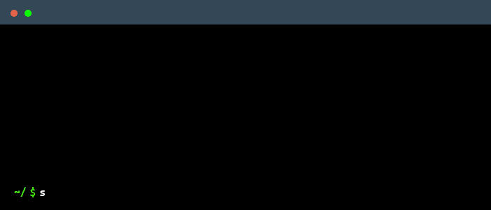

# Solthodox

</img>

## Languages and tools

  
  
  
  
  
  
  
  
  
  
  
  
  
  
  
  
  
  
  
  
  
  
  
  
  
  
  

##

  

## My blog posts

- [Uniswap V4 deeep dive](https://solthodox-website.vercel.app/articles/Uniswap%20V4%20deep-dive) 🦄
