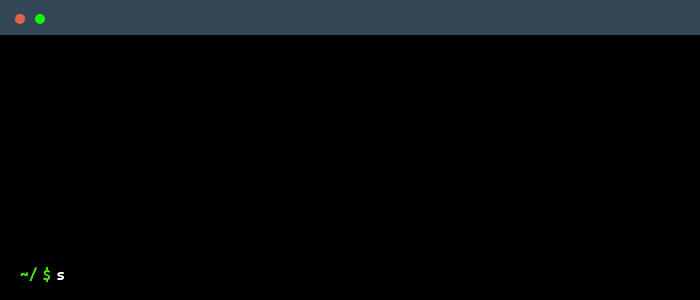

# Solthodox

</img>

> **Solidity / EVM engineer** designing, building, and **securing** DeFi protocols and on-chain financial infrastructure.

I architect production smart contract systems that have **deployed and managed millions in TVL**, and I protect user funds as a **smart contract security researcher** — manual review, fuzzing, invariant testing, and adversarial protocol reasoning. Experience across DEX infrastructure, yield vaults, stablecoins, and liquidity protocols with teams including **Keyrock**, **Mangrove DEX**, **Veris Labs**, and **Thesis Defense**.

- 🛠️ **Build:** AMMs/DEXs, ERC-4626 / ERC-7540 vaults, staking, yield strategies, liquidity infrastructure
- 🛡️ **Secure:** competitive audits & private security reviews protecting on-chain capital
- ⚙️ **Stack:** Solidity, EVM, Ethereum · Rust · TypeScript / Node.js · Foundry, Hardhat, Slither
- 🌍 Spain · [Website](https://solthodox-website.vercel.app/) · [X / Twitter](https://twitter.com/solthodox) · [LinkedIn](https://www.linkedin.com/in/solthodox/)

## Featured projects

| Project | Description | Stack |
| --- | --- | --- |
| [metavault](https://github.com/Solthodox/metavault) | Cross-chain ERC-7540 vault for aggregated liquidity | Solidity |
| [ERC7540](https://github.com/Solthodox/ERC7540) | Optimized implementation of the ERC-7540 async vault standard | Solidity |
| [maxapy](https://github.com/Solthodox/maxapy) | Optimized DeFi yield strategies on autopilot | Solidity |
| [erc4626-checklist](https://github.com/Solthodox/erc4626-checklist) | Security checklist for novel ERC-4626 vaults | Security |
| [solbin](https://github.com/Solthodox/solbin) | Binary Solidity snippets — bit manipulation library | Solidity / Yul |
| [CPAMM](https://github.com/Solthodox/CPAMM) | Constant Product Automated Market Maker | Solidity |

## Competitive audits

Public audit contests — top finishes protecting live protocols. Full repo: [Solthodox/audits](https://github.com/Solthodox/audits).

| Contest | Placement | Platform | Date | Report |
| --- | --- | --- | --- | --- |
| [Morpho Blue](https://cantina.xyz/competitions/d86b7f95-e574-4092-8ea2-78dcac2f54f1) | 🎖️ #10 | Cantina | Dec 2023 | [Findings](https://github.com/Solthodox/audits/blob/main/Contests/MorphoBlue.md) |
| [Superform](https://cantina.xyz/competitions/d86b7f95-e574-4092-8ea2-78dcac2f54f1) | 🎖️ #13 | Cantina | Nov 2023 | [Findings](https://github.com/Solthodox/audits/blob/main/Contests/Superform.md) |

<!-- Add new competitive results here. -->

## Public audit reports

Private security reviews for production DeFi protocols.

| Protocol | Scope | Date | Report |
| --- | --- | --- | --- |
| [Possum Labs](https://www.possumlabs.io/) | PortalsV2 — upfront yield on staked yield-bearing assets | Mar 2024 | [PDF](https://github.com/Solthodox/audits/blob/main/PrivateAudits/PossumLabs-security-review-portalsV2.pdf) |
| [Affine DeFi](https://affinedefi.com/) | Restaking | Feb 2024 | [PDF](https://github.com/Solthodox/audits/blob/main/PrivateAudits/affine-restaking-2024-02-29.pdf) |
| [GOAT Finance](https://www.goat.fi/) | DeFi yield optimizer | Feb 2024 | [PDF](https://github.com/Solthodox/audits/blob/main/PrivateAudits/Goat-security-review.pdf) |
| [AstroLab](https://astrolab.fi/) | Omni-chain yield aggregator | Feb 2024 | [PDF](https://github.com/Solthodox/audits/blob/main/PrivateAudits/AstroLabDao-security-review.pdf) |
| [Possum Labs](https://www.possumlabs.io/) | TimeRift — DeFi, staking & token conversion | Dec 2023 | [PDF](https://github.com/Solthodox/audits/blob/main/PrivateAudits/PossumLabs-security-review.pdf) |

<!-- Add new public reports here. -->

> 🛡️ **Need an audit?** Reach out on [X / Twitter](https://twitter.com/solthodox), [Telegram](https://t.me/mrWojack), or [Discord](https://discordapp.com/users/solthodox).

## My blog posts

- [Uniswap V4 deeep dive](https://solthodox-website.vercel.app/articles/Uniswap%20V4%20deep-dive) 🦄
- [Exploring bit manipulation in smart contracts](https://solthodox-website.vercel.app/articles/Exploring%20bit%20manipulation%20in%20smart%20contracts) 🛠️
- [Analysing the next bullrun](https://solthodox-website.vercel.app/articles/Analysing%20the%20next%20bullrun) 🐂

## Languages and tools

  
  
  
  
  
  
  
  
  
  
  
  
  
  
  
  
  
  
  
  
  
  
  
  
  
  
  

## Stats

 
  

